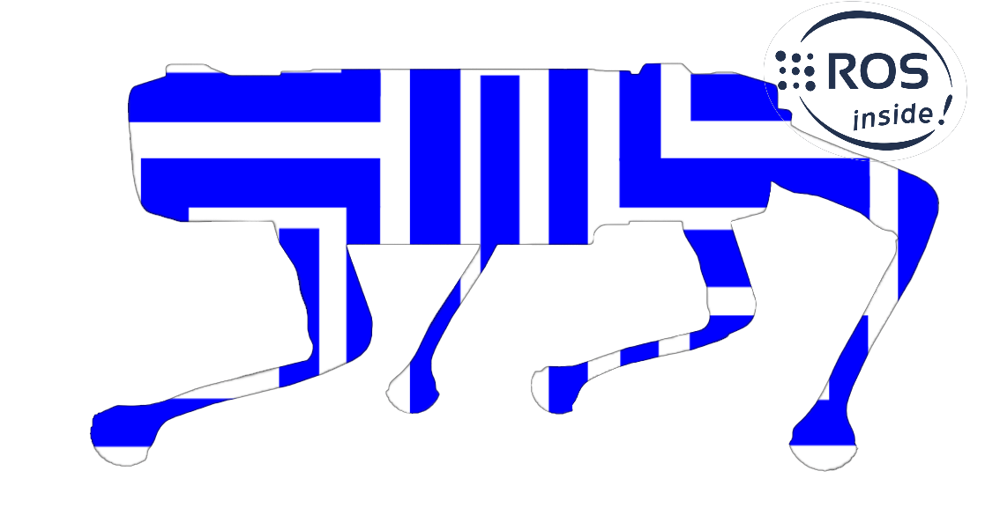

# GiadogROS

  

## Description

GiadoRos Is a project that includes the ros nodes for the gait generation and control of a quadrupedal robot. 

The systems consist on a raspberry pi that runs the ros container conected to an I2C pwm board that controls the 12 servos of the robot legs.
The raspberry is also connected to an arduino that recives gyro data from a IMU unit. Finally the robot is teleoperated using a ps3 controller via bluetooth.

## License

This project is licensed under the [MIT License](LICENSE).
